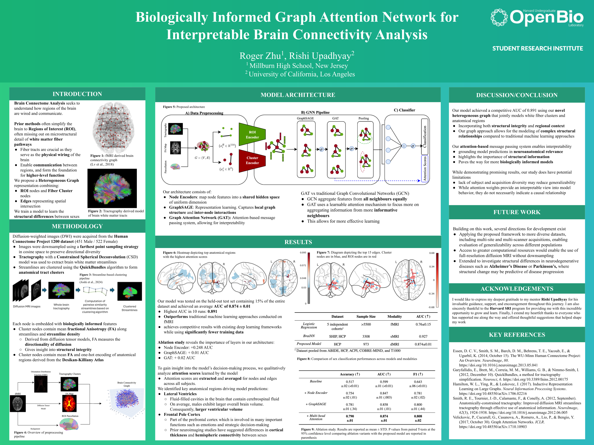

# Biologically informed Graph Attention Network for interpretable brain connectivity analysis

## Abstract
> Brain connectome analysis has long been a focus in neuroscience and neuroimaging research. However, many recent approaches focus heavily on fMRI and ROI-based modeling approaches, often overlooking key structural features and connectivity patterns of white matter tracts. In this work, we present a novel heterogeneous graph framework that incorporates structural features of white matter tracts, representing both white matter clusters and anatomical regions as nodes with edges capturing their spatial intersection. This approach allows us to model both structural integrity and connectivity, along with regional context for more biologically meaningful patterns. Using GraphSAGE for feature aggregation and multi-head Graph Attention Networks (GAT) for interpretability, our proposed architecture achieves an AUC of 0.891 for predicting gender on the Human Connectome Project 1200 dataset, matching the performance of other existing models and validating our graph construction while using significantly fewer training data. Furthermore, we extract attention scores, identifying key white matter tracts and anatomical regions involved in sex differentiation, grounding model predictions in neuroanatomical relevance. Our results highlight the importance of structural information and pave the way for more biologically informed models.

Keywords: Heterogeneous Graph Neural Networks, Diffusion MRI, White matter tracts, Sex classification

## Poster

